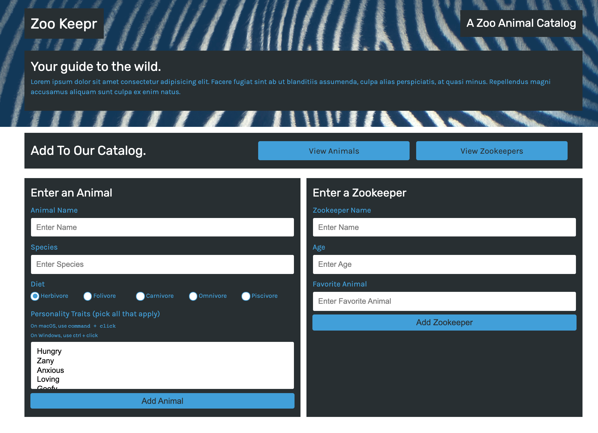

# zookeepr

## Description
Zookeepr is a full-stack online catalog. The data created will be stored on the server once it has been created. The app is built using Node.js, Express.js and Heroku for deployment. 

### Deployment 
[Link](https://guarded-earth-69892.herokuapp.com/)

### Screenshot

## Table of Contents (Optional)

If your README is very long, add a table of contents to make it easy for users to find what they need.

* [Installation](#installation)
* [Usage](#usage)
* [Credits](#credits)
* [License](#license)

## Installation

`npm i` >

## Usage 

To use the 
1. Open the terminal 
2. Run `npm start`
3. Open brower
4. Run localhost:3001

---

🏆 
## Badges

## Contributing / Credits

[mariamv29](https://github.com/mariamv29/README-generator.git)